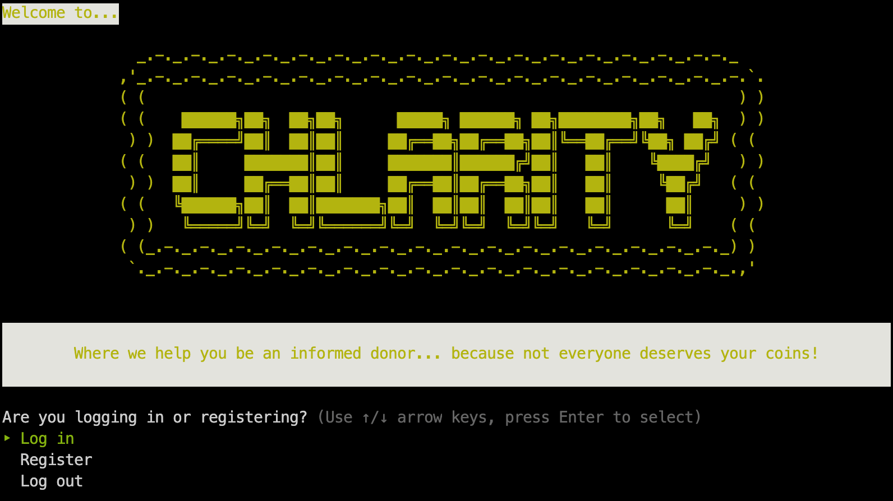

# Chlarity

**Chalarity** is a CLI app that allows you to look up charity ratings so you can be an informed donor.

## How to Install
1. Clone the repo onto your local machine.
1. Navigate to the repo directory from your terminal.
1. Run `bundle install` to install the required gems.
1. Run `rake db:migrate` to create the database.
1. Run `rake db:seed` to populate the database.
1. Run `ruby bin/run.rb` to open the app.

## Login / Register Menu
- Login if you already have an account
- Register if you don't have an account
- Log out

## Main Menu
1. Search for Charities - Allows you to look up all charities or only charities in your city
  - You can view, rate, and review charities from here.
2. View My Reivews - Shows all of your reviews
  - You can view, update or delete your reviews from here.

## Gems Used
- [TTY::Prompt](https://github.com/piotrmurach/tty-prompt)
- [TTY::Table](https://github.com/piotrmurach/tty-table#ttytable-)
- [Colorize](https://github.com/fazibear/colorize)
- [Ruby Paint](https://www.rubydoc.info/gems/paint/2.2.0)